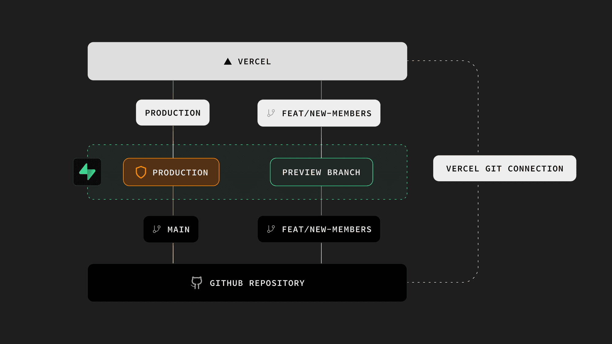

# 📚 Prueba- Gestor de Tareas Universitarias


## 🎓 Descripción

UniTask es una aplicación web desarrollada para ayudar a estudiantes universitarios a gestionar tareas, exámenes y actividades académicas de forma organizada.

El sistema permite registrar tareas, clasificarlas por materia, marcarlas como completadas y visualizar el progreso académico mediante estadísticas y barras de avance.

---

## ✨ Características

* ✅ Registro de tareas
* 📚 Organización por materias
* 📅 Fechas de entrega
* 📊 Estadísticas automáticas
* 📈 Barra de progreso
* 🌙 Modo oscuro
* 💾 Almacenamiento Local (LocalStorage)
* 📱 Diseño Responsive

---

## 🛠 Tecnologías Utilizadas

| Tecnología   | Uso                   |
| ------------ | --------------------- |
| HTML5        | Estructura            |
| CSS3         | Diseño                |
| JavaScript   | Funcionalidad         |
| LocalStorage | Persistencia de datos |
| GitHub       | Control de versiones  |
| Vercel       | Despliegue            |

---

## 📂 Estructura del Proyecto

```bash
UniTask/
│
├── index.html
├── style.css
├── app.js
│
├── img/
│   ├── banner.png
│   ├── dashboard.png
│   ├── tareas.png
│   └── estadisticas.png
│
└── README.md
```

---

# 📸 Versel

## Versel


---

## Versel



---

# 🚀 Instalación Local

### Clonar repositorio

```bash
git clone https://github.com/TU-USUARIO/UniTask.git
```

### Entrar al proyecto

```bash
cd UniTask
```

### Ejecutar

Abrir:

```bash
index.html
```

en cualquier navegador web.

---

# 🌐 Despliegue en GitHub

## Paso 1

Crear un nuevo repositorio llamado:

```bash
Prueba-App
```


---

## Paso 2

Subir todos los archivos del proyecto.

```bash
git init
git add .
git commit -m "Primer commit"
git branch -M main
git remote add origin https://github.com/TU-USUARIO/UniTask.git
git push -u origin main
```


---

# ☁️ Despliegue en Vercel

## Paso 1

Ingresar a:

https://vercel.com


---

## Paso 2

Iniciar sesión con GitHub.


---

## Paso 3

Seleccionar:

```text
Add New Project
```


---

## Paso 4

Importar el repositorio Prueba-App.


---

## Paso 5

Presionar:

```text
Deploy
```


---

## Paso 6

Esperar la compilación automática.


---

## Paso 7

Aplicación desplegada correctamente.

```text
https://Prueba-App.vercel.app
```

---

# 📊 Funcionalidades Implementadas

* Agregar tareas.
* Eliminar tareas.
* Marcar tareas completadas.
* Barra de progreso.
* Estadísticas automáticas.
* Persistencia con LocalStorage.
* Modo oscuro.
* Diseño adaptable a dispositivos móviles.

---

# 🎯 Objetivo del Proyecto

Desarrollar una aplicación web que permita a estudiantes universitarios organizar sus actividades académicas y mejorar la gestión de su tiempo mediante herramientas digitales sencillas y accesibles.

---

# 👨‍💻 Autor

**Equipo 2**

UNIFRANZ

Carrera: Ingeniería de Sistemas

Gestión 2026

---

# 📄 Licencia

Proyecto desarrollado con fines académicos y educativos.
